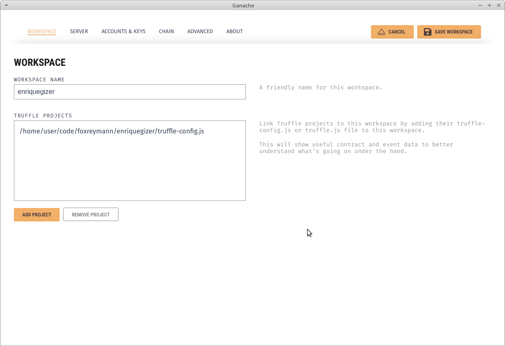
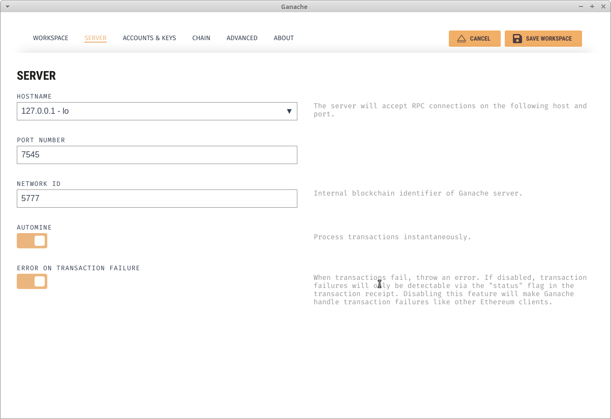

# Tools

[Truffle Framework](https://truffleframework.com/docs/truffle/overview) - development environment, testing framework and asset pipeline for blockchains using the Ethereum Virtual Machine (EVM)  
[Ganache](https://truffleframework.com/ganache) - one click personal Ethereum blockchain  

# Set up

- Install node.js & npm
- [Install Truffle](https://truffleframework.com/docs/truffle/getting-started/installation)
- [Install Ganache](https://truffleframework.com/ganache)
- Clone this GitHub repository
- Start Ganache
- Create new workspace in Ganache. In 'Workspace' tab import `truffle-config.js` file from cloned repository.

- Save the workspace and run it. In Ganache UI you can inspect state of your local Ehtereum blockchain.
- Open your terminal
- `$ cd enriquegizer`
- `$ truffle console --netowrk=ganache`
- In truffle console:
  - Run `migrate` to deploy contract to your Ganache network
  - Run `test` to run end to end tests
